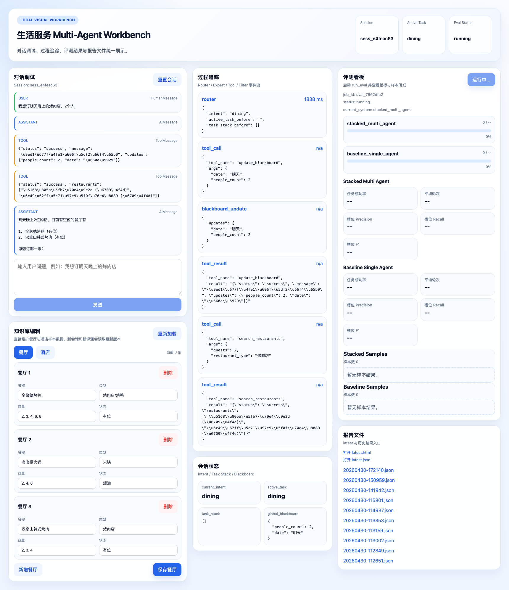
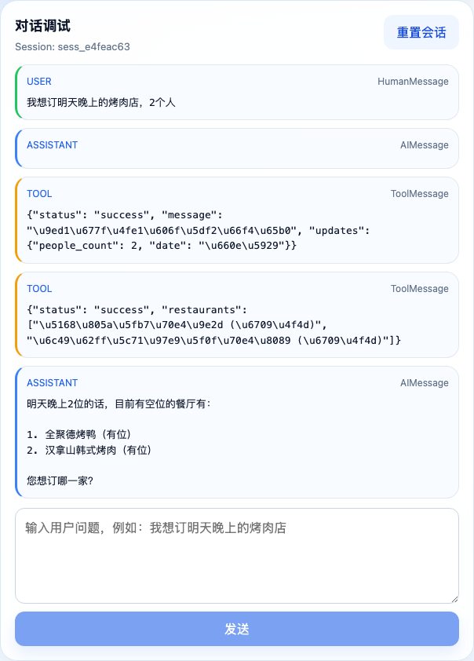
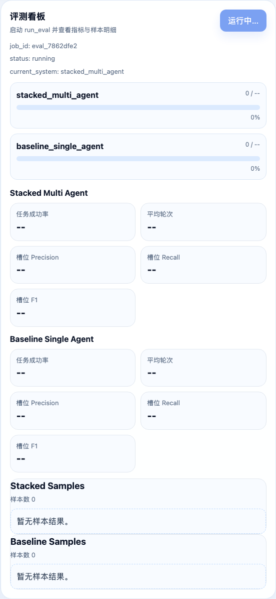
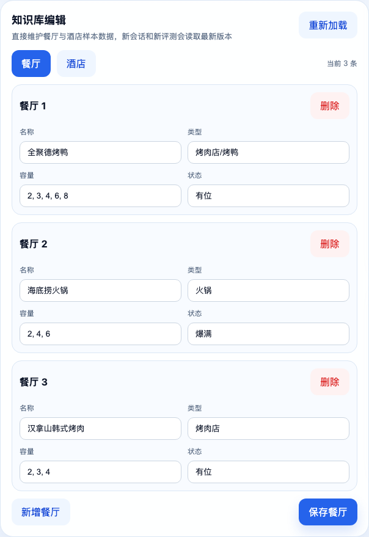

# Multi-Agent Dialog System

一个面向生活服务场景的多智能体对话系统原型，围绕“任务栈 + 全局黑板 + 领域专家协作”实现多轮任务型对话、工具调用、过程可视化与离线评测。

项目当前已经包含：

- 多智能体对话核心实现
- 基于 FastAPI 的本地服务层
- 基于 React + TypeScript 的可视化工作台
- 批量评测、指标计算与报告生成
- 可视化知识库编辑器

## 运行界面预览

以下截图来自项目真实运行过程，覆盖对话、调试、评测与知识库维护场景。

### 工作台总览



### 对话与过程调试



### 评测看板与指标



### 知识库编辑



## 项目亮点

- 支持餐饮、酒店等生活服务场景的多轮任务型对话
- 使用 `task_stack` 处理打断、切题与任务恢复
- 使用 `global_blackboard` 共享跨专家上下文与槽位信息
- 支持工具调用熔断与评测单样本超时保护，避免长时间卡死
- 提供三栏 Web 工作台，同时查看聊天、Trace、状态、评测进度和报告
- 提供知识库编辑窗口，可直接修改餐厅和酒店数据并用于新会话与新评测

## 系统架构

项目整体分为四层：

1. 对话核心层
   - `multi_agent_dialog/`
   - 包含路由、专家、状态、图编排与工具调用逻辑
2. 服务接口层
   - `app/`
   - 基于 FastAPI 暴露聊天、评测、报告、知识库等接口
3. 可视化工作台
   - `web/`
   - 基于 React + TypeScript 展示对话、Trace、状态、评测和知识库编辑
4. 评测与报告层
   - `evaluation/`
   - 包含数据集、runner、metrics、reporting 和批量评测入口

## 目录结构

```text
multi_agent_dialog_system/
├── app/                    # FastAPI 服务层
│   ├── api/                # HTTP 路由
│   ├── schemas/            # Pydantic schema
│   ├── services/           # 会话、评测、报告、知识库等服务
│   └── server.py           # FastAPI 入口
├── multi_agent_dialog/     # 多智能体对话核心
├── evaluation/             # 数据集、评测与报告生成
├── data/                   # 运行时知识库数据
├── tests/                  # 测试
├── web/                    # React + TS 工作台
├── docs/                   # 使用文档、设计与实施文档
├── scripts/                # 辅助脚本
├── main.py                 # 命令行对话入口
└── requirements.txt        # Python 依赖
```

## 核心能力

### 1. 多智能体对话管理

- 路由器负责意图识别与专家分发
- 领域专家负责餐饮、酒店等具体任务执行
- 对话状态中维护 `messages`、`task_stack`、`active_task`、`global_blackboard`、`knowledgebase`
- 支持真实 API 会话创建、重置与多轮消息发送

### 2. 可视化工作台

工作台默认分为三列：

- 左栏：聊天 + 知识库编辑
- 中栏：Trace + State
- 右栏：评测 + 报告

适合用于：

- 调试路由与专家行为
- 观察工具调用轨迹
- 查看当前任务栈和黑板状态
- 发起批量评测并观察实时进度
- 浏览生成的 HTML / JSON / SVG 报告

### 3. 离线评测

支持对以下系统进行对比评测：

- `stacked_multi_agent`
- `baseline_single_agent`

当前评测包括：

- `task_success_rate`
- `average_turns`
- `slot_precision`
- `slot_recall`
- `slot_f1`

评测数据位于 `evaluation/datasets/life_service_eval.json`，入口位于 `evaluation/run_eval.py`。

### 4. 知识库编辑

系统已支持通过前端直接编辑生活服务知识库：

- 餐厅列表
- 酒店列表
- 餐厅容量文本转数组校验
- 保存后用于新会话、重置会话与新评测任务

知识库存放在 `data/knowledgebase.json`。

已存在会话默认继续使用创建时的快照，这是有意设计的快照语义。

## 快速开始

### 1. 安装 Python 依赖

```bash
python3 -m venv venv
source venv/bin/activate
pip install -r requirements.txt
```

### 2. 安装前端依赖

```bash
cd web
npm install
cd ..
```

### 3. 启动后端

```bash
python3 -m uvicorn app.server:app --host 127.0.0.1 --port 8000
```

### 4. 启动前端

```bash
cd web
npm run dev -- --host 127.0.0.1 --port 5173
```

### 5. 打开工作台

- 前端：`http://127.0.0.1:5173/`
- 后端：`http://127.0.0.1:8000/`
- 如果 `5173` 已被占用，Vite 可能自动切换到 `5174`

## 常用运行方式

### 命令行对话

```bash
python3 main.py
```

### 批量评测

```bash
python3 evaluation/run_eval.py
```

评测完成后，会在 `evaluation/results/` 下生成：

- `latest.json`
- `latest.html`
- `latest-task_success_rate.svg`
- `latest-average_turns.svg`
- `latest-slot_f1.svg`

### 自动生成 README 截图

```bash
cd web
node scripts/capture_readme_screenshots.mjs
```

生成的图片会写入 `docs/assets/`。

## 测试

运行全部测试：

```bash
pytest
```

如果只想跑知识库相关测试：

```bash
pytest tests/test_knowledgebase_service.py tests/test_api_knowledgebase.py -v
```

## API 概览

当前后端主要提供以下接口：

- `/api/chat/session`
  - 创建会话
- `/api/chat/session/{session_id}`
  - 获取会话或重置会话
- `/api/chat/session/{session_id}/turn`
  - 发送用户消息并返回消息、状态与 traces
- `/api/eval/run`
  - 启动评测任务
- `/api/eval/jobs/{job_id}`
  - 查询评测进度、当前系统与部分指标
- `/api/eval/jobs/{job_id}/result`
  - 获取完整评测结果
- `/api/reports/latest`
  - 获取最新报告元数据
- `/api/reports/history`
  - 获取历史报告列表
- `/api/reports/file`
  - 访问本地报告文件
- `/api/knowledgebase`
  - 读取知识库
- `/api/knowledgebase/restaurants`
  - 更新餐厅数据
- `/api/knowledgebase/hotels`
  - 更新酒店数据

## 文档

- [使用文档](docs/USER_GUIDE.md)
- [知识库设计](docs/superpowers/specs/2026-04-30-knowledgebase-editor-design.md)
- [工作台计划](docs/superpowers/plans/2026-04-30-visual-workbench.md)
- [知识库实施计划](docs/superpowers/plans/2026-04-30-knowledgebase-editor.md)
- [评测系统计划](docs/superpowers/plans/2026-04-30-evaluation-system.md)

## 当前实现状态

已完成：

- 多智能体对话图
- 路由器与专家协作
- 工具调用链路
- Trace 采集
- 可视化工作台
- 批量评测与自动报告
- 评测进度条
- 报告在线访问
- 知识库编辑器

当前项目更适合作为：

- 课程设计 / 毕业设计原型
- 任务型 Agent 系统实验平台
- 多智能体对话管理研究样例

## 注意事项

- 本项目中的生活服务数据是本地原型数据，不是生产真实数据
- 评测结果受模型、提示词和工具实现影响较大
- 已有会话不会在知识库保存后自动热更新，这是设计上的快照语义
